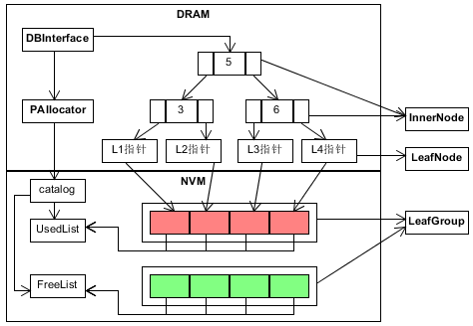
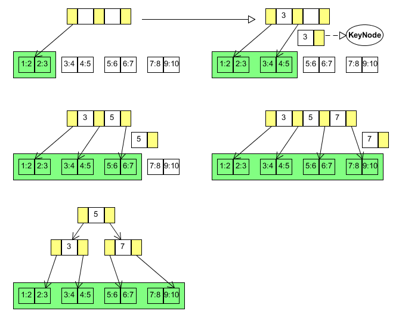
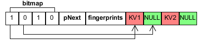

# 代码框架讲解
下面针对框架中的每一个主要对象以及其组成进行实现说明，关于代码中各个函数的具体实现请看[函数实现](函数实现.md)和源码。

## 相关知识
本次课程设计会涉及很多基本知识，详情如下:
1. 键值数据库系统
2. 数据库Benchmark(YCSB, TPC-C等)
3. makefile
4. Google Test单元测试
5. LevelDB(Google的键值存储系统)
6. NVM编程(使用PMDK)
7. FPTree数据结构


## FPTreeDB键值存储系统
本次课程设计基于针对NVM优化的数据结构FPTree，实现一个简单的键值存储引擎FPTreeDB。我们通过将其包装成一个调用库，供用户程序使用并管理其数据存储，与LevelDB的使用方式类似。  
其对外可用的对数据的基本操作就增删改查：
1. Insert增
2. Remove删
3. Update改
4. Find查

对于系统恢复，我们采取课本介绍的BulkLoading方式即可。  

所以，实现上述5大基本操作，也就实现了大部分函数，系统就能正常运行。系统架构如下：  


## 说明
项目目录说明
```
|__gtest: 为Google Test项目目录，不用管  
|__include: 里包含所有用到的头文件  
   |__fptree: fptree的头文件所在文件夹  
      |__fptree.h: fptree地头文件  
   |__utility: fptree所用工具的头文件所在文件夹  
      |__utility.h: 指纹计算等工具函数所在头文件  
      |__clhash.h: 指纹计算所用哈希函数头文件  
      |__p_allocator.h: NVM内存分配器头文件  
|__src: 为项目源码所在地，完成里面所有的实现  
   |__bin: 可执行文件所在文件夹
      |__main: main.cpp的可执行文件
      |__lycsb: lycsb.cpp的可执行文件
      |__ycsb: ycsb.cpp的可执行文件
   |__fptree.cpp: fptree的源文件，项目核心文件
   |__clhash.c: 指纹计算的哈希函数源文件  
   |__p_allocator.cpp: NVM内存分配器源文件 
   |__lycsb.cpp: LevelDB的YCSB测试代码
   |__ycsb.cpp: FPTreeDB和LevelDB的YCSB对比测试代码
   |__makefile: src下项目的编译文件  
|__workloads: 为YCSB测试负载文件，用于YCSB Benchmark测试  
   |__数据量-rw-读比例-写比例-load.txt: YCSB测试数据库装载文件  
   |__数据量-rw-读比例-写比例-run.txt: YCSB测试运行文件  
|__test: 为Google Test用户测试代码所在，请完成编译并通过所有测试  
   |__bin: 单元测试可执行文件所在文件夹
      |__fptree_test: fptree_test.cpp的可执行文件
      |__utility_test: utility_test.cpp的可执行文件
   |__fptree_test.cpp: fptree相关测试  
   |__utility_test.cpp: PAllocator等相关测试  
   |__makefile: gtest单元测试的编译文件   
```

对于FPTree实现，总体理解其实很简单，可以如下理解：
1. 对于FPTree的中间节点实现，模仿B+tree实现理解即可，实现也以课本伪代码为参考。
2. 对于FPTree的叶子节点，其特殊只在其结构上，并且要用PMDK与NVM进行数据交互，其基本操作与论文的去掉加锁并行后的伪代码一致。
3. 对于PAllocator，就是一个叶子的持久化指针和文件空间分配器，承担叶子文件的映射打开工作。

---
## PMDK
这次课程设计使用的是PMDK的libpmem库，这是其最基本的一个库，pmem映射部分见根目录下的前期工作与论文总结文件夹里的相关文件，FPTree中所有涉及NVM的操作利用其进行。编程要用到的函数如下：
1. pmem_map_file：打开并映射文件
2. pmem_persist：持久化对NVM内容的修改

## YCSB测试
这是一个键值数据库性能测试的benchmark，细节请看其[github仓库](https://github.com/brianfrankcooper/YCSB)。  
YCSB大体上分两个步，第一步是读取load文件，插入一定量的数据对数据库进行初始化。第二步是读取run文件，进行数据库相关操作。load和run文件的一条操作语句如下:
```
INSERT 6284781860667377211
```
上面INSERT表示插入操作，后面是键值。因为FPTreeDB键值对为8bytes-8bytes，所以**只需取这个值的前8字节即可**。为了简单起见，**键和值取相同即可**。测试结果见项目根目录下的fptree性能测试。

## Google Test单元测试
单元测试的源文件在test文件夹下，每个测试的名称对应其要测试的目标函数和功能。

## FPTree
这是整个键值存储系统的接口类，通过其调用InnerNode进而调用LeafNode进行键值对操作。一个FPTree就是一个键值对数据库，对应一个文件夹。其数据文件与PAllocator的管理文件存在在同一个文件夹下。定义在utility.h中的DATA_DIR变量，我们的fptree使用的pmdk地址为/mnt/mem，
### 增删改查
这些只是操作的接口函数，只需调用节点的函数即可。

### BulkLoading
#### 直接对应函数
bool FPTree::bulkLoading()

#### 函数说明
这是树重建的主要函数。在新建一个树的时候，先检查目标文件夹内有没有数据文件，遍历文件进行BulkLoading。没有数据文件则进行新树的生成。例子如下：  


---

## Node
这是InnerNode和LeafNode的父类对象，其相关限制在子类对象一样适用。其有一些两种节点共有的属性，本身的方法大多是纯虚函数，由子对象自己实现。

---
## KeyNode
这个数据结构由一个代表键值和节点的索引组成，用于节点分裂时，将新生成的节点索引返回给上层节点插入记录。其用在插入操作和分裂操作中。如下图的插入操作:  


---
## InnerNode
管理方法和书本的B+tree基本一致。这是FPTree中间索引节点，其不存放键值对数据信息。这个数据结构的内容已经给出，结构如下：  

### 节点元素细节
通过对节点的合并和分裂操作，保证每个节点的元素个数限制在以下范围(FPTree的根少于d)：  
key个数 : d <= m <= 2d </br>
node指针个数 : d + 1 <= m < = 2d + 1 </br>

记得保持节点元素有序，这样才可以使用二分查找findIndex。**键值的搜索规则是左闭右开原则**，与书本的一直，即Km <= search <Km+1，Km和Km+1所夹住的索引即为目标节点

### 键值对删除
#### 直接对应函数
bool InnerNode::remove(Key k, int index, InnerNode* parent, bool &ifDelete)
#### 函数参数说明
1. k：目标键值对的键
2. index：当前节点属于其父亲节点的第几个元素
3. parent：当前节点的父亲节点
4. ifDelete：当前节点为空则需要删除，返回给父亲节点是否删除的信息

index和parent都是方便节点删除元素后进行重分布或者合并操作，方便获得其兄弟节点。返回值为是否删除成功。

#### 函数说明
这是InnerNode删除键值对元素的函数，其不进行实际的键值对删除，通过递归调用其子节点删除，一直到叶子节点进行实际的删除。对子节点返回的信息进行处理，识别其下层调用的节点是否要被删除。删除子节点的时候，识别当前节点元素是否符合限制，不符合则进行重分布，重分布不行再合并。

#### 细节
当其子节点需要删除时，检查是否需要重分布和合并。合并的时候需要注意其父亲节点是否是根节点且其只有两个孩子，那么就合并这三者。注意的是如果同时有左右兄弟，左兄弟可以进行重分布，右兄弟可以合并，优先重分布。删除过程中一共有7种情况：
1. 子节点没有被删除，ifDelete返回给父亲节点
2. 子节点被删除，出现下面6六种情况：
   1. 当前节点元素足够，不需要进行重分布和合并
   2. 当前节点元素不够，与左兄弟重分布
   3. 当前节点元素不够，与右兄弟重分布
   4. 当前节点元素不够，与左兄弟合并
   5. 当前节点元素不够，与右兄弟合并
   6. 当前节点元素不否，父亲只有两个孩子(左或右)且父亲节点为根节点，合并这三者

#### 调用的函数
1. int InnerNode::findIndex：二分查找目标子节点。
2. void InnerNode::getBrother()：获得中间节点的左右兄弟节点。如果左右兄弟都存在，统一处理右兄弟。
3. void InnerNode::redistributeRight()：与右兄弟重分布
4. void InnerNode::redistributeLeft()：与左兄弟重分布
5. void InnerNode::mergeLeft()：与左兄弟合并
6. void InnerNode::mergeRight()：与右兄弟合并
7. void InnerNode::mergeParentLeft()：与父亲节点以及左兄弟合并
8. void InnerNode::mergeParentRight()：与父亲节点以及右兄弟合并
9. int InnerNode::findIndex()：二分查找

### 键值对插入
#### 直接对应函数
KeyNode* InnerNode::insert(Key k, Value v)
#### 函数参数说明
1. k：插入键值对的键
2. v：插入键值对的值

返回值为KeyNode，下层子节点分裂后生成新的节点，将节点索引以及代表键值返回给上层节点插入
#### 函数说明
这是InnerNode插入键值对的函数，不进行实际的键值对插入，通过递归调用其子节点插入，直至叶子结点进行实际的插入。对子节点分裂后返回的KeyNode值进行插入。例子如下：  


#### 细节
第一次插入或者只有一个叶子时，也只有一个中间节点，这时候需要特殊处理。形成两个叶子后插入正常进行。当节点元素多过限制时，进行节点分裂操作。
#### 调用的函数
1. KeyNode* InnerNode::split()：分裂满了的节点
2. int InnerNode::findIndex()：二分查找
3. void InnerNode::insertNotFull()：节点不满直接插入，保持元素有序
4. void FPTree::changeRoot(): 当根节点满时分裂，并产生新的根节点
### 键值对查询
#### 直接对应函数
Value InnerNode::find(Key k)
#### 函数说明
这是InnerNode的查询函数，不进行实际的查询。二分查找目标子节点，递归调用其对应子节点的查询函数，直至叶子节点进行实际的查询，返回查询得到的值。查询失败返回MAX_VALUE。

### 键值对修改
#### 直接对应函数
bool InnerNode::update(Key k, Value v)

#### 函数说明
这是InnerNode更新键值对的函数，递归调用至叶子节点进行实际的更新，返回值为是否更新成功。因为框架限制，不能执行论文里的先插入再删除策略实现更新，有想法的同学可以将返回值改成KeyNode*，在叶子节点的update里进行先插入在删除（测试代码不兼容，请另外实现一个函数，注明为额外工作）。

---
## LeafNode
这是整个FPTree存储数据的直接对象，所有键值对数据只存放于叶子节点中。所以叶子节点也是与NVM交互的对象，只要是操作PAllocator映射NVM文件后的虚拟地址，通过文件映射的方式操作相应数据文件。因为节点的操作对象是内存映射文件数据后的虚拟地址，所以关键是设置好NVM数据的指针。结构如下：  

### 节点元素细节
为了减少对NVM的写操作，叶子的元素个数只需控制小于2d即可，没有元素就删除叶子。所以没有叶子节点的合并操作。但是叶子满了也需要分裂
键值对个数 : 0 < m < 2d </br>

### 键值对删除
#### 直接对应函数
bool LeafNode::remove(Key k, int index, InnerNode* parent, bool &ifDelete)

#### 函数说明
参数的作用与InnerNode的相同，这个函数是删除键值对操作流程的最后调用，执行对N存放在NVM的叶子进行键值对的删除，将位图置0即可。**需要注意的是叶子节点没有合并操作。**

### 键值对插入
#### 直接对应函数
KeyNode* LeafNode::insert(Key k, Value v)

#### 函数说明
这个是键值对插入流程的最后调用，其执行数据的真正插入。主要操作是对文件的插入，这个通过操作映射后的虚拟地址就可以像操作内存变量一样写入，然后调用持久化命令即可。

### 键值对查询
#### 直接对应函数
Value LeafNode::find(Key k)

#### 函数说明
这是叶子节点进行真正的数据查找函数。其首先遍历位图，找寻有数据的槽。然后先对比键值的键值是否一样，进行过滤。最后再对比键值是否一样。

### 键值对修改

#### 直接对应函数
bool update(Key k, Value v)

#### 函数说明
由于TA早期没有注意，使得框架实现成直接修改更新，所以大家就直接对目标键值对修改更新即可。想修改成论文先插入再删除的策略请另外实现一个函数，需要考虑插入后分裂的情况，并注明额外工作。

---
## PAllocator
这是NVM文件管理的主要对象，其负责分配LeafNode在NVM中的空间，映射数据文件并返回虚拟地址给LeafNode使用。其管理的叶子文件的粒度是一个LeafGroup，一个LeafGroup由多个叶子以及一个数据头组成，数据头由一个8字节的当前LeafGroup使用叶子数和叶子槽的bitmap，bitmap为了简单使用1个byte指明一个槽位。  

### 主要数据文件
1. LeafGroup结构：| usedNum(8 bytes) | bitmap(n bytes) | Leaf1 | ... | leafN |
2. catelog：| maxFileId(8 bytes) | freeNum(8 bytes) | treeStartLeaf(PPointer) |
3. freeList：| (fId, offset)1, ..., (fId)N |

LeafGroup是数据文件，其文件名用整数表示，从1递增分配即可，规定0为非法标号。PAllocator需要记录分配文件的最大标号，即catalog文件的maxFileId。catalog文件中freeNum为当前可用叶子数，treeStartLeaf为第一个叶子的持久化指针，用于重载树时从其开始，通过链表形式重载。freeList文件每个条目为空叶子的持久化指针，用于启动即可知道可用叶子。

### 持久化指针映射到虚拟地址的原理
每个叶子拥有一个唯一的持久化指针PPointer，其fId识别某一个LeafGroup文件，而offset则表明其位于此LeafGroup的哪个位置。所以通过PMDK根据fId打开一个LeafGroup后，就可以获得此LeafGroup的开头虚拟地址，而每一个叶子的虚拟地址通过开头地址加上offset即可得到。

### 运行流程
PAllocator为单例模式，一个PAllocator管理一个FPTree。FPTree初始化时PAllocator也要初始化，初始化其管理变量，将已有的叶子通过PMDK的打开文件方式内存映射成虚拟地址，进行PPointer与虚拟地址的转化，供FPTree使用。

## 数据文件说明
### utility.h中需要使用的常量
``` C++
#define LEAF_DEGREE 56 // 叶子的度
#define INNER_DEGREE 4096 // 中间节点的度

#define MAX_KEY UINT64_MAX; // 键值最大值
#define MAX_VALUE UINT64_MAX; // 值的最大值

#define LEAF_GROUP_AMOUNT 16 // 一个LeafGroup含有的叶子数
#define ILLEGAL_FILE_ID   0
```
### 所有数据文件均为定长
本次课程设计有的数据文件有catalog，freelist以及许多LeafGroup。**代码中注释含有的分隔符只是方便说明，并不是说数据文件中以这些分隔符做数据分隔**。因为数据文件中所有的数据均是定长的，没有变长，所以每个数据变量头尾相接存放即可。对于叶子节点，因为每个键值对是8字节键8字节值，通过上面的LEAF_DEGREE确定叶子含有的键值对个数，那么每个叶子的大小也是可以确定了。上面的LEAF_GROUP_AMOUNT决定了每个LeafGroup的叶子数，那么每个LeafGroup的大小也就确定了。
