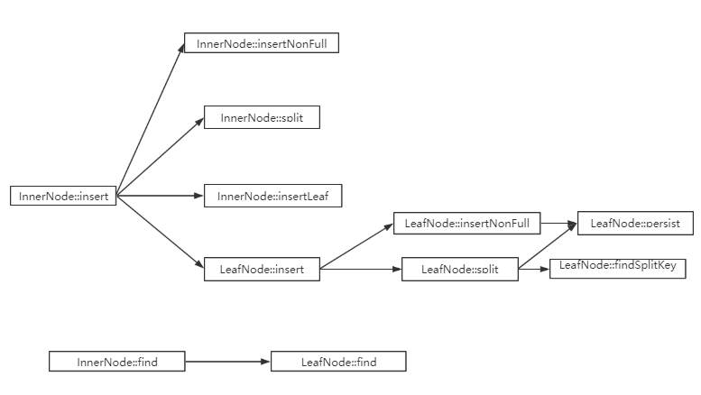

# 函数实现说明
此文档是对此次项目函数的具体实现过程，是对源码的具体补充说明。包含了以下几个内容

- p_allocator实现：
  - PAllocator::PAllocator()；
  - void PAllocator::initFilePmemAddr()；
  - PAllocator::~PAllocator()；
  - char* PAllocator::getLeafPmemAddr(PPointer p)；
  - bool PAllocator::getLeaf(PPointer &p, char* &pmem_addr)；
  - bool PAllocator::ifLeafUsed(PPointer p)；
  - bool PAllocator::ifLeafFree(PPointer p)；
  - bool PAllocator::ifLeafExist(PPointer p)；
  - bool PAllocator::freeLeaf(PPointer p)；
  - bool PAllocator::persistCatalog()；
  - bool PAllocator::newLeafGroup()；
- fb_tree实现：
- 插入操作和重载操作：
  - InnerNode::insert()；
  - InnerNode::insertNonFull()；
  - InnerNode::split()；
  - LeafNode::insert()；
  - InnerNode::insertLeaf()；
  - FPTree::bulkLoading()；
- 操作和更新：
  - FPTree::find()；
  - InnerNode::find()；
  - LeafNode::find()；
  - FPTree::update()；
  - InnerNode::update()；
  - LeafNode::update()；
- 删除
  - bool InnerNode::remove()；
  - void InnerNode::getBrother()；
  - void InnerNode::mergeParentLeft()；
  - void InnerNode::mergeParentRight()；
  - void InnerNode::redistributeLeft()；
  - void InnerNode::redistributeRight()；
  - void InnerNode::mergeLeft()；
  - void InnerNode::mergeRight()；
  - bool LeafNode::remove()；
  - void FPTree::recursiveDelete()；
  - bool FPTree::remove()

主要是对需要我们实验的函数的功能介绍。
## p_allocator实现
p_allocator是NVM文件管理的主要对象PAllocator，叶子的持久化指针和文件空间分配器，承担叶子文件的映射打开工作，对应着p_allocator.cpp，其负责分配LeafNode在NVM中的空间，映射数据文件并返回虚拟地址给LeafNode使用。其管理的叶子文件的粒度是一个LeafGroup，一个LeafGroup由多个叶子以及一个数据头组成，数据头由一个8字节的当前LeafGroup使用叶子数和叶子槽的bitmap，bitmap为了简单起见用一个byte来标识一个位。

**PAllocator::PAllocator()**

这个函数需要完成的工作是：

- 判断是否创建了catelog,freeList文件
  - 如果创建了上述文件，则从文件中读入数据给变量赋值
  - 如果没有创建上述文件，则创建文件，同时对变量进行初始化
- 执行initFilePmemAddr() 

**void PAllocator::initFilePmemAddr()**

这个函数完成的工作是：

- 将1~maxFileId-1的LeafGroup文件映射到虚拟地址并将每一组映射存储在fId2PmAddr中

**PAllocator::~PAllocator()**

这个函数完成的工作是：

- 退出时将所有的变量作为数据写入文件中
- 将所有变量初始化

**char* PAllocator::getLeafPmemAddr(PPointer p)**

这个函数完成的工作是：

- 返回fId2PmAddr对应的虚拟地址加上偏移量

**bool PAllocator::getLeaf(PPointer &p, char* &pmem_addr)**

这个函数完成的工作是：

- 判断freeNum是否为0
  - 如果为0，调用newLeafGroup()函数
  - 如果不为0，从freeList中分配排在最后面的空闲块并对相应变量进行更改
- 写回磁盘

**bool PAllocator::ifLeafUsed(PPointer p)**

这个函数完成的工作是：

- 通过判断bitmap位来判断是否使用过

**bool PAllocator::ifLeafFree(PPointer p)**

这个函数完成的工作是：

- return !ifLeafUsed(p);

**bool PAllocator::ifLeafExist(PPointer p)**

这个函数完成的工作是：

- 通过判断fId和offset的属性是否超出规则来判断是否合法

**bool PAllocator::freeLeaf(PPointer p)**

这个函数完成的工作是：

- 判断是否p是否存在
  - 如果存在，设置相应的属性并将其加入freeList中，并且设置相应的变量
    - 如果成功，返回true
    - 否则返回false
  - 如果不存在，返回false

**bool PAllocator::persistCatalog()**

这个函数完成的工作是：

- 将catelog数据写回到磁盘上

**bool PAllocator::newLeafGroup()**

这个函数完成的工作是:

- 分配一个新的LeafGroup并创建一个相应的文件
- 将这个LeafGroup中的所有leaf都加入Freelist中
- 对相关变量进行设置


## fptree实现
fptree.h中共有四个类，分别是Node,InnerNode,LeafNode,FPtree

其中Node是InnerNode和LeafNode的父类，同时每种Node中都有一个FPtree成员变量，标志着该Node属于哪颗树。

值得注意的是叶子节点的degree是确定的，由fptree.h中的LEAF_DEGREE指定，而中间节点的degree是实时赋值的


### 插入操作和重载操作

这两个操作需要实现的函数如下：

```c++
// InnerNode构造函数
InnerNode::InnerNode(const int& d, FPTree* const& t, bool _isRoot) {}
// InnerNode析构函数
InnerNode::~InnerNode() {}
// 查找InnerNode中比插入键大的第一个键的位置
int InnerNode::findIndex(const Key& k) {}
// 节点不满直接插入，保持元素有序
void InnerNode::insertNonFull(const Key& k, Node* const& node) {}
// 插入操作
KeyNode* InnerNode::insert(const Key& k, const Value& v) {}
// 插入叶子节点
KeyNode* InnerNode::insertLeaf(const KeyNode& leaf) {}
// 对中间节点进行分裂
KeyNode* InnerNode::split() {}
// LeafNode构造函数
LeafNode::LeafNode(FPTree* t) {}
// LeafNode构造函数
LeafNode::LeafNode(PPointer p, FPTree* t) {}
// LeafNode析构函数
LeafNode::~LeafNode() {}
// 向叶子中插入键值对
KeyNode* LeafNode::insert(const Key& k, const Value& v) {}
// 向判断为未满的叶子节点中插入键值对
void LeafNode::insertNonFull(const Key& k, const Value& v) {}
// 叶子节点分裂(当叶子节点已经满了并且还需要插入时)
KeyNode* LeafNode::split() {}
// 找到叶子节点的中位键并返回
Key LeafNode::findSplitKey() {}
// 获取bitmap中的某一个bit
int LeafNode::getBit(const int& idx) {}
// 数据持久化
void LeafNode::persist() {}
// 重载函数
bool FPTree::bulkLoading() {}
```

这些函数的调用关系如下图所示：



以下是详细的说明：

**InnerNode::insert()**

这个函数完成的工作是：

- 判断当前节点是否为根节点，以及当前节点键的数量是否为0
  - 如果是查看孩子节点的数量是否为0
    - 如果孩子的数量为0，新开一个叶子节点并对该叶子节点进行未满时插入操作
    - 否则直接进行未满时插入操作。插入后如果该叶子节点满了就进行分裂
- 对孩子节点进行递归调用insert(k,v)操作
- 如果新孩子不为NULL，也即为分裂之后，需要进行相应的设置

**InnerNode::insertNonFull()**

这个函数完成的工作是：

- 向当前中间节点中插入一个keyNode

**InnerNode::split()**

这个函数完成的工作是：

- 判断当前中间节点是否为满的，如果不是报错并返回NULL值
- 将当前节点的右半部分分配到新的节点
- 对相关属性进行设置

**LeafNode::insert()**

这个函数完成的工作是：

- 调用LeafNode::insertNonFull()函数插入键值对
- 判断是否满，如果是进行分裂

**LeafNode::persist()**

这个函数完成的工作是：

- 将当前叶子节点中的数值写回到磁盘中

**LeafNode::insertNonFull()**

这个函数完成的工作是：

- 找到叶子节点中第一个为空的节点，即bitmap相应位置中为0的地址
- 在找到的地址中进行键值对的插入操作

**LeafNode::split()**

这个函数完成的工作是：

- 新开一个叶子节点
- 将键大于中位数的所有键值对移动到新节点上
- 对相应的属性进行设置

**InnerNode::insertLeaf()**

这个函数完成的工作是：

- 对第一个和第二个将要被插入树中的叶子节点进行特殊处理
- 如果下一级并非叶子节点，继续调用insertLeaf(),并对中间节点满的情况进行处理
- 如果下一级是叶子几点，把要插入的叶子节点加入到当前中间节点的孩子中
- 判断根节点是否需要分裂，如果需要则进行相关的操作

insertLeaf()函数将被bulkLoading()函数调用

**FPTree::bulkLoading()**

这个函数完成的工作是：

- 从当前树的第一个叶子节点开始调用inserLeaf()函数，依次将叶子节点插入到树上
- 为每一个要插入到树上的叶子节点设置prev，next指针分别指向前一个叶子节点和后一个叶子节点

### 操作和更新
这两个操作操作涉及到的函数：
```c++
// 按照键查找值
Value FPTree::find(Key k) {}
// 按照键查找值（中间节点向下搜索
Value InnerNode::find(const Key& k) {}
// 按照键查找值（在叶子节点中搜索
Value LeafNode::find(const Key& k) {}
// 更新键对应的值
bool FPTree::update(Key k, Value v) {}
// 更新键对应的值（中间节点向下查找并更新
bool InnerNode::update(const Key& k, const Value& v) {}
// 更新键对应的值（在叶子节点中查找并更新
bool LeafNode::update(const Key& k, const Value& v) {}
```
以下是详细的说明

**FPTree::find()**

这个函数完成的工作如下：

- 调用根节点的find()函数

**InnerNode::find()**

这个函数的功能如下：

- 递归向下寻找键所在的叶子节点
- 找到相应叶子节点后调用叶子节点的find()函数

**LeafNode::find()**

这个函数的功能如下：

- 在当前叶子节点中按照键查找bit为1的位置，直到找到键对应的值并返回

**FPTree::update()**

这个函数完成的工作如下：

- 调用根节点的update()函数

**InnerNode::update()**

这个函数的功能如下：

- 递归向下寻找键所在的叶子节点
- 找到相应叶子节点后调用叶子节点的update()函数

**LeafNode::update()**

这个函数功能如下：

- 在叶子节点中按照键查找bit为1的位置，直到找到键对应的位置，并把值修改为新的值

### 删除
删除键值对涉及到的重要函数如下：

```c++
// 中间节点中根据键值找到目标并删除
bool InnerNode::remove(const Key& k, const int& index, InnerNode* const& parent, bool &ifDelete) {}
// 获取中间节点的左兄弟和右兄弟
void InnerNode::getBrother(const int& index, InnerNode* const& parent, InnerNode* &leftBro, InnerNode* &rightBro) {}
// 合并当前节点，父亲节点以及左兄弟节点
void InnerNode::mergeParentLeft(InnerNode* const& parent, InnerNode* const& leftBro) {}
// 合并当前节点，父亲节点以及右兄弟节点
void InnerNode::mergeParentRight(InnerNode* const& parent, InnerNode* const& rightBro) {}
// 重新分配左兄弟和当前节点的keys以及children
void InnerNode::redistributeLeft(const int& index, InnerNode* const& leftBro, InnerNode* const& parent) {}
// 重新分配右兄弟和当前节点的keys以及children
void InnerNode::redistributeRight(const int& index, InnerNode* const& rightBro, InnerNode* const& parent) {}
// 合并当前节点与左兄弟节点到左兄弟
void InnerNode::mergeLeft(InnerNode* const& leftBro, const Key& k) {}
// 合并当前节点与右兄弟节点到右兄弟
void InnerNode::mergeRight(InnerNode* const& rightBro, const Key& k) {}
// 移除孩子节点
void InnerNode::removeChild(const int& keyIdx, const int& childIdx) {}
// 叶子节点中寻找键值对并删除
bool LeafNode::remove(const Key& k, const int& index, InnerNode* const& parent, bool &ifDelete) {}
// 删除所有节点
void FPTree::recursiveDelete(Node* n) {}
// 调用根节点的remove()删除某个键值对
bool FPTree::remove(Key k) {}
```

下面我将详细介绍上述函数的功能以及实现

**bool InnerNode::remove()**

这个函数完成的工作如下：

- 对FPtree只有一个叶子或没有叶子的情况做特殊处理
- 对于一般情况，找到键所在的孩子节点，**递归调用**remove()函数
- 当判断不需要删除孩子节点时，直接返回
- 否则删除键所在位置的孩子节点
- 如果当前节点的孩子数量大于degree，则判断为不需要删除孩子节点
- 否则
  - 如果当前节点为根节点，直接返回
  - 获取当前节点的两个兄弟节点
    - 查看是否需要合并当前节点，父亲节点以及兄弟节点
    - 查看是否需要合并当前节点和兄弟节点

**void InnerNode::getBrother()**
返回自己的左右兄弟

这个函数完成的工作如下：

- 判断索引值是否不合法，若是，左右兄弟皆为空
- 判断索引值是否为0
  - 若是，左兄弟为空
  - 否则，左兄弟是自己的左兄弟
- 判断所引致是否为父亲节点的(孩子数-1)
  - 若是，右兄弟为空
  - 否则，右兄弟是自己的右兄弟

**void InnerNode::mergeParentLeft()**
合并自己、左兄弟到父亲节点

这个函数完成的工作如下：

- 父亲合并左孩子节点的keys
- 父亲合并当前节点的keys
- 父亲合并左孩子节点的children
- 父亲合并当前节点的children
- 父亲的相关属性重新设置
- 删除左兄弟节点

**void InnerNode::mergeParentRight()**
合并自己、右兄弟到父亲节点

这个函数完成的工作如下：

- 父亲合并当前节点的keys
- 父亲合并右孩子节点的keys
- 父亲合并当前节点的children
- 父亲合并右孩子节点的children
- 父亲的相关属性重新设置
- 删除右兄弟节点

**void InnerNode::redistributeLeft()**
与左兄弟重分布（左兄弟有更多元素）

这个函数完成的工作如下：

- 将当前节点的keys和children挪动位置以方便稍后的移动
- 将左兄弟节点多出来的节点移动到当前节点腾出的位置上
- 设置当前节点和左兄弟节点的相关属性
- 更改父亲节点对应的键

**void InnerNode::redistributeRight()**
与右兄弟重分布（右兄弟有更多元素）

这个函数完成的工作如下：

- 将右兄弟节点需要重新分配keys和children分配到当前节点中
- 对右兄弟节点上的没有被重新分配的keys和children挪动到最左侧
- 设置当前节点和右兄弟节点的相关属性
- 更改父亲节点对应的键

**void InnerNode::mergeLeft()**
将自己的数据移动到左兄弟

这个函数完成的工作如下：

- 将当前节点的keys和children都移动到左兄弟中
- 更改左兄弟相关属性
- 删除当前节点

**void InnerNode::mergeRight()**
将自己的数据移动到左兄弟

这个函数完成的工作如下：

- 右兄弟挪动keys和children，以给当前节点中的keys和children腾出位置
- 将当前节点的keys和children都移动到右兄弟中
- 更改右兄弟相关属性
- 删除当前节点

**void InnerNode::removeChild()**

这个函数完成的工作如下：

- 判断索引值是否合法，非法则直接返回
- 从要删除的孩子节点位置开始，将keys和children的值都改为右邻居的值
- 对相关属性进行设置

**bool LeafNode::remove()**

这个函数完成的工作如下：

- 通过指纹技术确认需要删除键值对的位置pos
- 对bitmap,n等值进行设置
- 进行持久化
- 判断叶子节点中的键值对数目是否为0，如果是，则删除房前叶子节点

**void FPTree::recursiveDelete()**

这个函数完成的工作如下：

- 判断参数是否为叶子节点，是则删除
- 递归调用recursiveDelete()函数，删除完所有的孩子节点后，删除自身

**bool FPTree::remove() **

这个函数完成的工作如下：

- 调用根节点的remove函数
