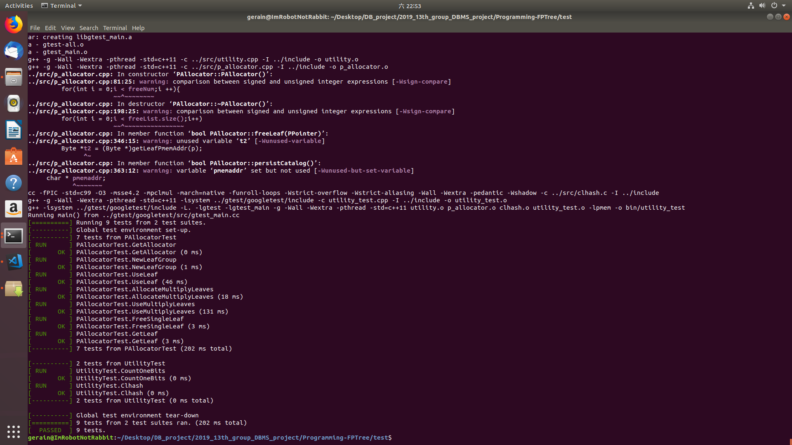
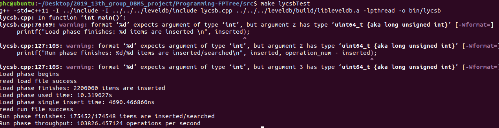

#系统说明书
[一份GitHub的使用教程](./GitHub使用提示.md)
# 数据库课程设计系统说明
我们要实现一个键值存储系统，系统的实现参考leveldb以及FPTree。

leveldb是google的一个键值存储系统，github仓库见https://github.com/google/leveldb

FPTree是Oukid提出的一种适用于SCM(Storage Class Memory)的一类新型的B树，详见前期工作与论文阅读总结文件夹下的Oukid_FPTree.pdf论文。

另外，我们需要实现NVM文件管理的主要对象PAllocator，对应着p_allocator.cpp，其负责分配LeafNode在NVM中的空间，映射数据文件并返回虚拟地址给LeafNode使用。其管理的叶子文件的粒度是一个LeafGroup，一个LeafGroup由多个叶子以及一个数据头组成，数据头由一个8字节的当前LeafGroup使用叶子数和叶子槽的bitmap，bitmap为了简单使用1个byte指明一个槽位。  

## FPTreeDB键值存储系统
本次课程设计基于针对NVM优化的数据结构FPTree，实现一个简单的键值存储引擎FPTreeDB。我们通过将其包装成一个调用库，供用户程序使用并管理其数据存储，与LevelDB的使用方式类似。  
其对外可用的对数据的基本操作就增删改查：
1. Insert增
2. Remove删
3. Update改
4. Find查

对于系统恢复，我们采取课本介绍的BulkLoading方式。  

我们的基本目标是实现上述5大基本操作，使系统能正常运行。系统架构如下：  


我们预期完成：
1. 单线程版本的FPTree
2. NVM相关编程

## 项目文件说明
```
|__gtest: 为Google Test项目目录，不用管  
|__include: 里包含所有用到的头文件  
   |__fptree: fptree的头文件所在文件夹  
      |__fptree.h: fptree地头文件  
   |__utility: fptree所用工具的头文件所在文件夹  
      |__utility.h: 指纹计算等工具函数所在头文件  
      |__clhash.h: 指纹计算所用哈希函数头文件  
      |__p_allocator.h: NVM内存分配器头文件  
|__src: 为项目源码所在地，完成里面所有的实现  
   |__bin: 可执行文件所在文件夹
      |__main: main.cpp的可执行文件
      |__lycsb: lycsb.cpp的可执行文件
      |__ycsb: ycsb.cpp的可执行文件
   |__fptree.cpp: fptree的源文件，项目核心文件(TODO)  
   |__clhash.c: 指纹计算的哈希函数源文件  
   |__p_allocator.cpp: NVM内存分配器源文件(TODO)  
   |__lycsb.cpp: LevelDB的YCSB测试代码(TODO)  
   |__ycsb.cpp: FPTreeDB和LevelDB的YCSB对比测试代码(TODO)  
   |__makefile: src下项目的编译文件  
|__workloads: 为YCSB测试负载文件，用于YCSB Benchmark测试  
   |__数据量-rw-读比例-写比例-load.txt: YCSB测试数据库装载文件  
   |__数据量-rw-读比例-写比例-run.txt: YCSB测试运行文件  
|__test: 为Google Test用户测试代码所在，请完成编译并通过所有测试  
   |__bin: 单元测试可执行文件所在文件夹
      |__fptree_test: fptree_test.cpp的可执行文件
      |__utility_test: utility_test.cpp的可执行文件
   |__fptree_test.cpp: fptree相关测试  
   |__utility_test.cpp: PAllocator等相关测试  
   |__makefile: gtest单元测试的编译文件   
```

## PAllocator

PAllocator中管理三种比较重要的文件，分别为LeafGroup,catelog,freeList，它们的结构如下：

1. LeafGroup结构：| usedNum(8 bytes) | bitmap(n bytes) | Leaf1 | ... | leafN |

2. catelog：| maxFileId(8 bytes) | freeNum(8 bytes) | treeStartLeaf(PPointer) |

3. freeList：| (fId, offset)1, ..., (fId)N |

   

LeafGroup是数据文件，其文件名用整数表示，从1递增分配即可，规定0为非法标号。PAllocator需要记录分配文件的最大标号，即catalog文件的maxFileId。catalog文件中freeNum为当前可用叶子数，treeStartLeaf为第一个叶子的持久化指针，用于重载树时从其开始，通过链表形式重载。freeList文件每个条目为空叶子的持久化指针，用于启动即可知道可用叶子。

### 各个函数说明：

##### PAllocator::PAllocator() ；

这个函数需要完成的工作是：

* 判断是否创建了catelog,freeList文件
  * 如果创建了上述文件，则从文件中读入数据给变量赋值
  * 如果没有创建上述文件，则创建文件，同时对变量进行初始化
* 执行initFilePmemAddr() 

##### void PAllocator::initFilePmemAddr() ;

这个函数完成的工作是：

* 将1~maxFileId-1的LeafGroup文件映射到虚拟地址并将每一组映射存储在fId2PmAddr中

##### PAllocator::~PAllocator() ;

这个函数完成的工作是：

* 退出时将所有的变量作为数据写入文件中
* 将所有变量初始化

##### char* PAllocator::getLeafPmemAddr(PPointer p) ;

这个函数完成的工作是：

* 返回fId2PmAddr对应的虚拟地址加上偏移量

##### bool PAllocator::getLeaf(PPointer &p, char* &pmem_addr)；

这个函数完成的工作是：

* 判断freeNum是否为0
  * 如果为0，调用newLeafGroup()函数
  * 如果不为0，从freeList中分配排在最后面的空闲块并对相应变量进行更改
* 写回磁盘

##### bool PAllocator::ifLeafUsed(PPointer p) ；

这个函数完成的工作是：

* 通过判断bitmap位来判断是否使用过

##### bool PAllocator::ifLeafFree(PPointer p) ；

这个函数完成的工作是：

* return !ifLeafUsed(p);

##### bool PAllocator::ifLeafExist(PPointer p) ；

这个函数完成的工作是：

- 通过判断fId和offset的属性是否超出规则来判断是否合法

##### bool PAllocator::freeLeaf(PPointer p);

这个函数完成的工作是：

* 判断是否p是否存在
  * 如果存在，设置相应的属性并将其加入freeList中，并且设置相应的变量
    * 如果成功，返回true
    * 否则返回false
  * 如果不存在，返回false

##### bool PAllocator::persistCatalog() ;

这个函数完成的工作是：

* 将catelog数据写回到磁盘上

##### bool PAllocator::newLeafGroup() ；

这个函数完成的工作是:

* 分配一个新的LeafGroup并创建一个相应的文件
* 将这个LeafGroup中的所有leaf都加入Freelist中
* 对相关变量进行设置

##### 测试结果如下：



# lycsb测试leveldb

## 关于ycsb
ycsb全称Yahoo! Cloud Serving Benchmark，是一个键值数据库性能测试的benchmark，细节请看其[github仓库](https://github.com/brianfrankcooper/YCSB)。  
YCSB大体上分两个步，第一步是读取load文件，插入一定量的数据对数据库进行初始化。第二步是读取run文件，进行数据库相关操作。load和run文件的一条操作语句如下:
```
INSERT 6284781860667377211
```
上面INSERT表示插入操作，后面是键值。因为FPTreeDB键值对为8bytes-8bytes，所以**只需取这个值的前8字节即可**。为了简单起见，**键和值取相同即可**。
即将示例的6284781860667377211视为一个uint64_t类型的一个数据类型，同时将其作为插入数据库的键和值。

我们的测试并没有基于ycsb这个项目，只是依照ycsb的测试思路进行数据库性能的测试。对leveldb的ycsb测试源码详见Programming-FPTree/src/lycsb.cpp
## 关于leveldb
```
LevelDB is a fast key-value storage library written at Google that provides an ordered mapping from string keys to string values.
```

leveldb是一个快速的键值对数据库，提供有序的字符串类型的键与字符串类型的值之间的映射。

细节见其[github仓库](https://github.com/google/leveldb)。

以下是leveldb的简单安装与使用（测试环境Ubuntu18.04）。

### 安装
首先从github上获取leveldb的源码
```
git clone https://github.com/google/leveldb.git
```
然后编译，注意编译用到了cmake，如果没有cmake,首先安装cmake
```
sudo apt-get isntall cmake
```
接下来就是真正的编译环节
```
cd leveldb
mkdir -p build && cd build
cmake -DCMAKE_BUILD_TYPE=Release .. && cmake --build .
```

编译完了之后在build文件夹下会出现libleveldb.a文件，我们测试leveldb时使用静态编译，需要用到此文件。

### 使用
leveldb提供了简洁的api供我们使用，具体教程见[github上的文档](https://github.com/google/leveldb/blob/master/doc/index.md)
以下是简单的介绍：
#### 打开数据库：
```
#include <cassert>
#include "leveldb/db.h"

leveldb::DB* db;
leveldb::Options options;
options.create_if_missing = true;
leveldb::Status status = leveldb::DB::Open(options, "/tmp/testdb", &db);
assert(status.ok());
```
其中leveldb::Status是leveldb许多函数的返回值，标记了操作的成功与否，可以使用下面的语句测试操作是否成功：
```
leveldb::Status s = ...;
if (!s.ok()) cerr << s.ToString() << endl;
```

#### 关闭数据库
```
delete db;
```
其中db是要关闭的数据库的名字（打开数据库时所起的名字）

#### 读写操作
leveldb提供Get,Put,Delete三个api来操作数据库，操作示例如下:
```
std::string value;
leveldb::Status s = db->Get(leveldb::ReadOptions(), key1, &value);
if (s.ok()) s = db->Put(leveldb::WriteOptions(), key2, value);
if (s.ok()) s = db->Delete(leveldb::WriteOptions(), key1);
```
key和value都是leveldb::Slice类型，Slice有4种构造函数，如下：
Slice有2个成员变量：const char* data_;size_t size_;
```
Slice() : data_(""), size_(0) { }
Slice(const char* d, size_t n) : data_(d), size_(n) { }
Slice(const std::string& s) : data_(s.data()), size_(s.size()) { }
Slice(const char* s) : data_(s), size_(strlen(s)) { }
```
拷贝构造函数不再列举，
Slice的常用成员函数有：
```
const char* data() const { return data_; }
size_t size() const { return size_; }
```

以上介绍只是leveldb的基本操作，删减了很多内容，详见leveldb的GitHub的文档描述。


## 使用lycsb测试leveldb
lycsb代码仿照ycsb测试流程来测试leveldb的性能。
为了方便测试，我们将leveldb源码及编译后的文件放置于我们的代码的根路径。

### 代码流程
lycsb代码中关键部分如下：
首先是前面几个变量定义了workload的load文件和run文件，以及leveldb数据库文件的路径：
```
const string workload = "../workloads/";

const string load = workload + "220w-rw-50-50-load.txt"; // TODO: the workload_load filename
const string run  = workload + "220w-rw-50-50-run.txt"; // TODO: the workload_run filename

const string filePath = "/tmp/testdb";
```
其中workload是workloads文件夹的路径，load和run是load和run两个文件的路径，filename是leveldb的数据库文件的路径。

接下来就是打开并读取load文件进入内存，开始计时，按照load文件操作leveldb，完成数据的插入，结束计时，输出load过程的统计结果，

然后是读取run文件进入内存，开始计时，按照run文件操作leveldb，完成数据的插入，结束计时，输出run过程的统计结果，

根据以上两个过程的统计结果可以评测leveldb的性能。

但本次lycsb测试过程中并没有对操作的正确性进行验证。

### 测试过程
首先需要安装并编译leveldb，具体过程按照上述流程操作即可，为了方便使用，我们将leveldb源码及编译后的文件已放置于Programming-FPTree目录下，不用进行手动安装编译leveldb。

接下来是编译lycsb，编译过程中需要使用leveldb的静态链接，编译命令如下：
```
g++ lycsb.cpp -o ./bin/lycsb ../leveldb/build/libleveldb.a -lpthread -I ../leveldb/include/
```

然后准备开始测试，测试之前先把原来可能残余的数据库文件删除：
```
rm -rf /tmp/testdb
```

然后运行编译好的lycsb文件：
```
./bin/lycsb
```

以上测试都已在makefile中写好，使用时只需要到lycsb.cpp中把load和run文件的路径修改为需要的测试文件，然后在Programming-FPTree/src目录下运行
```
make lycsbTest
```
不需要进行其他操作。

使用220w-rw-50-50-load.txt和220w-rw-50-50-run.txt测试结果如图：


## 完成进度规划

1. 系统说明书，PAllocator实现并通过utility测试，LevelDB的使用以及测试，对应lycsb.cpp，p_allocator.cpp的实现和运行，utility_test.cpp的运行 --- 5/4晚前发布v1版本branch(不会分支的自学)
2. FPTreeDB插入和重载操作并通过相关测试，对应fptree.cpp的实现和fptree_test.cpp部分的运行 --- 5/11晚前发布v2版本branch
3. FPTreeDB查询和更新操作并通过相关测试，对应fptree.cpp的实现和fptree_test.cpp部分的运行 --- 5/18晚前发布v3版本branch
4. FPTreeDB删除操作和所有剩下实现以及测试，对应fptree.cpp的实现和fptree_test.cpp所有的运行 --- 5/31晚前发布final版本branch，作为最后发布版本

以上是基本时间规划，有时间的话会添加多线程版本和micro log的内容。

## 性能测试
关于数据库的性能测试，我们使用类似于ycsb的测试框架来测试FPtree的性能，使用google test来测试数据库实现的正确性。

## 完成进度

阶段一已经完成

