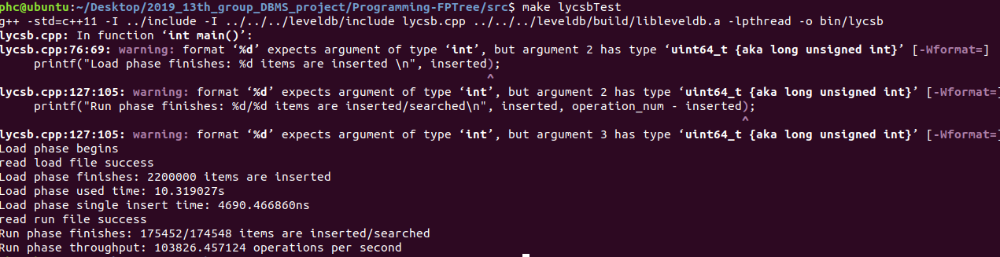
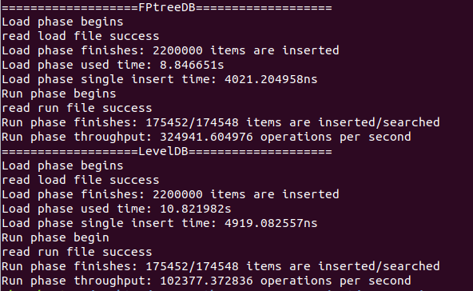

# fptree性能测试

## 前言
这里是简单的对我们实现的fptree的简单插入查询性能测试，没有涉及删除功能的性能测试部分。

我们测试的思路类似于ycsb的测试过程，测试时使用leveldb做基准来对fptree的性能做出定性分析。

以下是本文档的结构，可以直接跳转到文末看fptree性能测试的结论。


- [前言](#前言)
- [ycsb介绍](#ycsb介绍)
- [leveldb介绍](#leveldb介绍)
    - [leveldb安装](#leveldb安装)
    - [leveldb使用](#leveldb安装)
- [使用lycsb测试leveldb](#使用lycsb测试leveldb)
- [fptree的ycsb性能测试](#fptree的ycsb性能测试)
- [总结](#总结)

## ycsb介绍
ycsb全称Yahoo! Cloud Serving Benchmark，是一个键值数据库性能测试的benchmark，细节请看其[github仓库](https://github.com/brianfrankcooper/YCSB)。  
YCSB大体上分两个步，第一步是读取load文件，插入一定量的数据对数据库进行初始化。第二步是读取run文件，进行数据库相关操作。load和run文件的一条操作语句如下:
```
INSERT 6284781860667377211
```
上面INSERT表示插入操作，后面是键值。因为FPTreeDB键值对为8bytes-8bytes，所以**只需取这个值的前8字节即可**。为了简单起见，**键和值取相同即可**。
即将示例的6284781860667377211视为一个uint64_t类型的一个数据类型，同时将其作为插入数据库的键和值。

我们的测试并没有基于ycsb这个项目，只是依照ycsb的测试思路进行数据库性能的测试。对leveldb的ycsb测试源码详见Programming-FPTree/src/lycsb.cpp

## leveldb介绍
```
LevelDB is a fast key-value storage library written at Google that provides an ordered mapping from string keys to string values.
```

leveldb是一个快速的键值对数据库，提供有序的字符串类型的键与字符串类型的值之间的映射。

细节见其[github仓库](https://github.com/google/leveldb)。

以下是leveldb的简单安装与使用（测试环境Ubuntu18.04）。

### leveldb安装
首先从github上获取leveldb的源码
```
git clone https://github.com/google/leveldb.git
```
然后编译，注意编译用到了cmake，如果没有cmake,首先安装cmake
```
sudo apt-get isntall cmake
```
接下来就是真正的编译环节
```
cd leveldb
mkdir -p build && cd build
cmake -DCMAKE_BUILD_TYPE=Release .. && cmake --build .
```

编译完了之后在build文件夹下会出现libleveldb.a文件，我们测试leveldb时使用静态编译，需要用到此文件。

### leveldb使用
leveldb提供了简洁的api供我们使用，具体教程见[github上的文档](https://github.com/google/leveldb/blob/master/doc/index.md)
以下是简单的介绍：
#### 打开数据库：
```
#include <cassert>
#include "leveldb/db.h"

leveldb::DB* db;
leveldb::Options options;
options.create_if_missing = true;
leveldb::Status status = leveldb::DB::Open(options, "/tmp/testdb", &db);
assert(status.ok());
```
其中leveldb::Status是leveldb许多函数的返回值，标记了操作的成功与否，可以使用下面的语句测试操作是否成功：
```
leveldb::Status s = ...;
if (!s.ok()) cerr << s.ToString() << endl;
```

#### 关闭数据库
```
delete db;
```
其中db是要关闭的数据库的名字（打开数据库时所起的名字）

#### 读写操作
leveldb提供Get,Put,Delete三个api来操作数据库，操作示例如下:
```
std::string value;
leveldb::Status s = db->Get(leveldb::ReadOptions(), key1, &value);
if (s.ok()) s = db->Put(leveldb::WriteOptions(), key2, value);
if (s.ok()) s = db->Delete(leveldb::WriteOptions(), key1);
```
key和value都是leveldb::Slice类型，Slice有4种构造函数，如下：
Slice有2个成员变量：const char* data_;size_t size_;
```
Slice() : data_(""), size_(0) { }
Slice(const char* d, size_t n) : data_(d), size_(n) { }
Slice(const std::string& s) : data_(s.data()), size_(s.size()) { }
Slice(const char* s) : data_(s), size_(strlen(s)) { }
```
拷贝构造函数不再列举，
Slice的常用成员函数有：
```
const char* data() const { return data_; }
size_t size() const { return size_; }
```

以上介绍只是leveldb的基本操作，删减了很多内容，详见leveldb的GitHub的文档描述。


## 使用lycsb测试leveldb
lycsb代码仿照ycsb测试流程来测试leveldb的性能。
为了方便测试，我们将leveldb源码及编译后的文件放置于我们的代码的根路径。

### 代码流程
lycsb代码中关键部分如下：
首先是前面几个变量定义了workload的load文件和run文件，以及leveldb数据库文件的路径：
```
const string workload = "../workloads/";

const string load = workload + "220w-rw-50-50-load.txt"; // TODO: the workload_load filename
const string run  = workload + "220w-rw-50-50-run.txt"; // TODO: the workload_run filename

const string filePath = "/tmp/testdb";
```
其中workload是workloads文件夹的路径，load和run是load和run两个文件的路径，filename是leveldb的数据库文件的路径。

接下来就是打开并读取load文件进入内存，开始计时，按照load文件操作leveldb，完成数据的插入，结束计时，输出load过程的统计结果，

然后是读取run文件进入内存，开始计时，按照run文件操作leveldb，完成数据的插入，结束计时，输出run过程的统计结果，

根据以上两个过程的统计结果可以评测leveldb的性能。

但本次lycsb测试过程中并没有对操作的正确性进行验证。

### 测试过程
首先需要安装并编译leveldb，具体过程按照上述流程操作即可，为了方便使用，我们将leveldb源码及编译后的文件已放置于Programming-FPTree目录下，不用进行手动安装编译leveldb。

接下来是编译lycsb，编译过程中需要使用leveldb的静态链接，编译命令如下：
```
g++ lycsb.cpp -o ./bin/lycsb ../leveldb/build/libleveldb.a -lpthread -I ../leveldb/include/
```

然后准备开始测试，测试之前先把原来可能残余的数据库文件删除：
```
rm -rf /tmp/testdb
```

然后运行编译好的lycsb文件：
```
./bin/lycsb
```

以上测试都已在makefile中写好，使用时只需要到lycsb.cpp中把load和run文件的路径修改为需要的测试文件，然后在Programming-FPTree/src目录下运行
```
make testleveldb
```
不需要进行其他操作。

使用220w-rw-50-50-load.txt和220w-rw-50-50-run.txt测试结果如图：



## fptree的ycsb性能测试
以lyscb测试leveldb为例，我们可以以类似的代码流程来测试fptree的性能。

我们以leveldb为性能标准，在ycsb.cpp文件中同时以相同的workload文件测试fptree和leveldb，在已经写好的ycsb.cpp文件中默认为220w条目的workload,

在测试前先进入Programming-FPTree的src目录，测试指令为
```
make testfptree
```
注意我们的fptree的路径为/mnt/mem, leveldb的路径为/mnt/mem/testdb,
并且/mnt/mem是一个dax目录。

220万条目读写对等的ycsb测试结果如图：


可见在load阶段220万条目的插入中fptree用时8.84s, 平均插入耗时4021ns，leveldb用时10.82s，平均插入耗时4919ns，插入阶段fptree略快于leveldb

在run阶段进行了175452次插入，174548次查询，fptree每秒平均操作次数为324941次，leveldb每秒平均操作次数为102377次，fptree平均性能是leveldb的三倍。

而在10w条目的测试中fptree的性能普遍高于leveldb，但高出的幅度没有那么大。

# 总结
fptree的性能相对于leveldb而言还算不错，在大数据量下fptree的性能表现相比leveldb会逐步提高。

实验结果表明fptree是一个高效的数据结构。