# 论文阅读与前期工作总结
### 姓名：陈钦德, 陈王勇, 庞海成, 孟印真
### 学号：17343010，17343014, 17343093, 17343087
---
## 前期工作
### 使用示意图展示普通文件IO方式(fwrite等)的流程，即进程与系统内核，磁盘之间的数据交换如何进行？为什么写入完成后要调用fsync？
##### 写文件以fwrite()函数为例，流程如下：
(1)	开始时数据从外部设备输入或自应用层产生，随着IO操作进入IO函数的缓冲区，也即IOBuffer。
(2)	当IOBuffer满或者调用fflush(),fclose()等函数时,调用write()函数把数据写到系统内核的缓存中。
(3)	内核通过判断数据是否dirty来决定是否将数据写入磁盘。如果判断需要写入磁盘，那么将数据送入IO调度队列等候被驱动程序写入磁盘。此时可以调用fsync来确保数据写入磁盘。
(4)	同时这里可以回答题目中的另一个问题，即为什么调用fsync：fsync的功能是确保文件fd所有已修改的内容已经正确同步到硬盘上，该调用会阻塞等待直到设备报告IO完成。

##### 读文件以fread()函数为例，流程如下：

- (1)	开始时所请求的数据有可能存在于内核的缓冲区，也有可能存在于磁盘中。如果存在于内核缓冲区中且不是脏数据，直接将数据传递给用户程序。否则内核向下发出IO请求。
- (2)	IO调度层接受IO请求并根据调度算法回调驱动层对磁盘发出指令。
- (3)	磁盘收到指令后传输数据到内核的缓冲区
- (4)	将内核缓冲区中fread()函数调用的数据拷贝到该函数的IOBuffer中。
根据以上流程画出示意图如下：


### 简述文件映射的方式如何操作文件。与普通IO区别？为什么写入完成后要调用msync？文件内容什么时候被载入内存？
+ 简单文件映射使用的函数为mmap，头文件为<sys/mman.h>

+ 这个函数可以将一个磁盘文件映射到进程的虚拟地址空间，实现磁盘文件地址和进程虚拟地址的一一对应关系。这样就可以实现在进程访问这段内虚拟内存时，系统自动将脏页面写到对应的磁盘文件上。
+ 在了解mmap函数操作文件过程之前，我们需要先了解进程中的vm_area_struct结构。
vm_area_struct结构表示一个独立的虚拟内存区域，一个进程中有多个独立的虚拟内存区域，因此进程拥有多个vm_area_struct结构，它们以链表或者树型结构的形式存在。

 mmap函数原型为 void* mmap(void* start,size_t length,int prot,int flags,int fd,off_t offset);
##### 其操作文件的过程如下：
1.	首先需要在进程的虚拟地址空间中找出一段空闲的足够大小的连续地址
2.	然后为该连续地址分配一个vm_area_struct结构并根据mmap函数中的参数对该结构进行初始化。
3.	将该vm_area_struct结构插入到进程维护的相关链表（或树形图）中
4.	通过参数中的文件描述符找到将要被映射的文件所在的磁盘地址
5.	通过remap_pfn_range函数实现虚拟地址和磁盘文件地址的一一对应关系。
6.	进程初次访问时，由于此时并没有数据关联到主存，引发缺页异常。
7.	将文件读入主存中，此时进程可以对这段内存进行操作。
8.	若出现脏页面，系统将在一定时间后更新磁盘文件的内容。
如此mmap完成了一次文件映射过程。

##### 与普通IO的区别在于：
1.	文件映射使得进程访问文件就像访问普通内存一样，不必再调用read(),write()函数，从而省去系统调用的开销，加快访问速率，提高效率。
2.	同时文件映射的方式可以通过将同一个文件映射到不同进程的地址空间来实现共享。

修改后的脏页面不会立即更新到磁盘文件上，调用msync()可以实现强制更新。

当进程初次访问文件时，由于此时并没有数据关联到主存，引发缺页异常，然后才会将文件载入内存。

### 参考Intel的NVM模拟教程模拟NVM环境，用fio等工具测试模拟NVM的性能并与磁盘对比（关键步骤结果截图）。
操作步骤如下：
1. 根据教程中的内容设置模拟NVM内存区域。通过dmesg命令查询得知4G-5G为可用内存，于是为NVM分配的内存：memmap=1G!4G
 

2.	随后通过以下操作使设置生效，并重启虚拟机

```
# sudo grub-mkconfig -o /boot/grub/grub.cfg
```

3. 设置好后内存分区呈现以下情况
 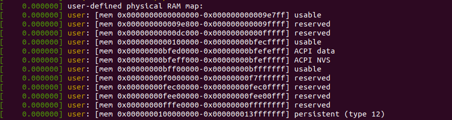

4. 通过lsblk命令查看磁盘分区，发现多出一个pmem0
 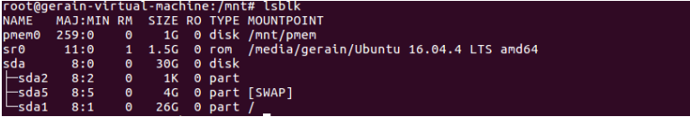

5. root模式创建目录/mnt/mem 

    ```
    sudo mkdir /mnt/mem
    ```

6. 将pmem0初始化并将/dev/pmem0 挂载到 /mnt/mem: 

    ```
    sudo sudo mkfs.ext4 /dev/pmem0
    sudo mount -o dax /dev/pmem0 /mnt/mem
    ```

    设置好之后通过lsblk查看发现pmem0已经挂载到/mnt/mem上了

    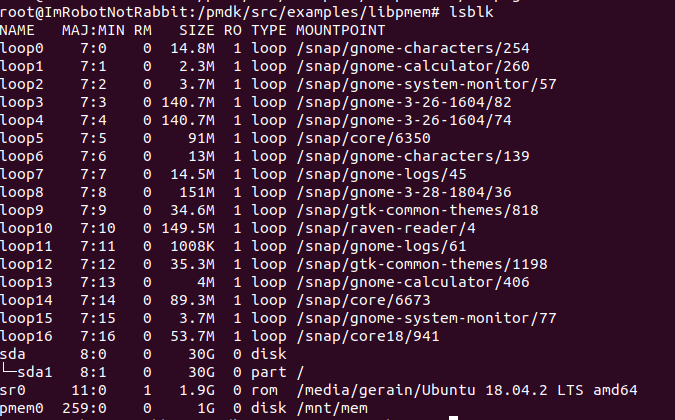

7. 分别测试pmem0区和sda1区随机读写的能力，并进行对比
    首先是**pmem0随机写能力测试**(请放大查看)：显示的带宽bw为5571MB/s，每秒io次数iops为742818
     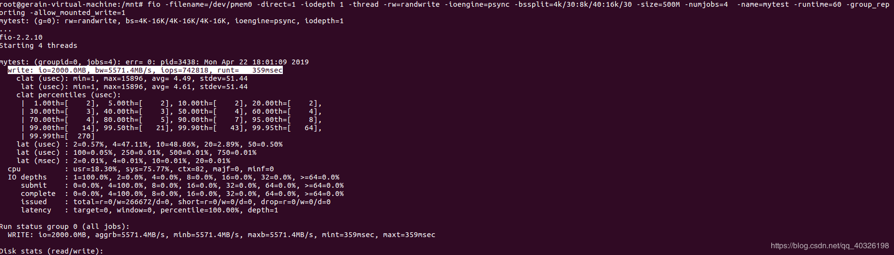
    然后是**sda1随机写能力测试**(请放大查看) ，显示的带宽bw为3238KB/s，每秒io次数iops为357
     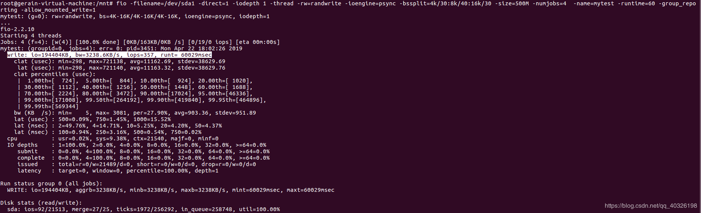
    接下来进行**pmem0随机读能力测试**，结果如下，显示的带宽bw为157200KB/s，每秒io次数iops为20469
     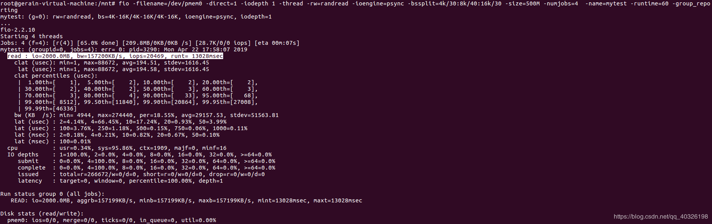
    **sda1随机读测试**如下，显示的带宽bw为2661KB/s，每秒io次数iops为293
     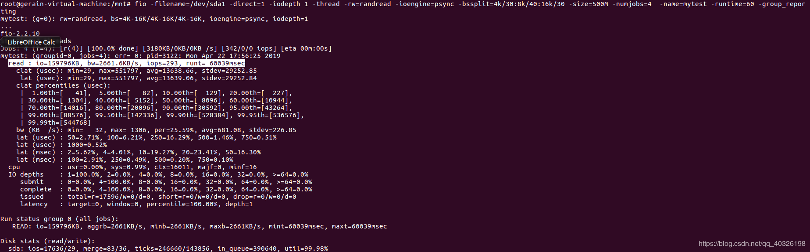
    **可以看出NVM的性能远远高于磁盘的性能。**


### 使用[PMDK的libpmem库](http://pmem.io/pmdk/libpmem/)编写样例程序操作模拟NVM（关键实验结果截图，附上编译命令和简单样例程序）。
（样例程序使用教程的即可，主要工作是编译安装并链接PMDK库)
我们选择的系统是ubuntu18.10，之前是在ubuntu16.04LTS上进行配置的，不过在16.04LTS上配置会出现很多问题，有一些库是完全不支持16.04LTS，最低版本都是以18.04起步的，所以在16.04LTS上安装的时候会出现不少问题，而在18.10上就没有此类的问题了。

ps：在执行的时候最好用sudo权限，因为你不知道什么时候需要sudo权限，还不如都用上。

我们首先设置出口网络代理：

	export https_proxy=”https://child-prc.intel.com:913/” 
	export http_proxy=”http://child-prc.intel.com:913/” 
	export socks_proxy=”socks://child-prc.intel.com:913/” 
	export ftp_proxy=”ftp://child-prc.intel.com:913/

只有正确的设置了网络代理，后面的安装过程才会更加的顺利，不过实际上设不设置都无所谓的。

然后我们就是安装ndctl，在安装之前我们首先需要进行一些依赖库的下载，有可能他会提示你有一些archives无法得到，不过这并不重要。

	sudo apt-get install autoconf asciidoc xmlto automake libtool systemd pkg-config libkeyutils-dev asciidocor
	sudo apt-get install libkmod-dev libudev-dev bash-completion

以上的库都是可以直接安装成功的。然后还需要安装一些不可以直接使用apt-get安装的。

我们首先安装json-c，首先要确保你的电脑里面有git。

	git clone https://github.com/json-c/json-c.git
	cd json-c
	sudo sh autogen.sh
然后是进行配置

	./configure  # --enable-threading
	make
	make install

最后是进行检测

	make check
	make USE_VALGRIND=0 check   # optionally skip using valgrind

然后我们需要安装libuuid。

	wget https://versaweb.dl.sourceforge.net/project/libuuid/libuuid-1.0.3.tar.gz 
	tar -zxvf libuuid-1.0.3.tar.gz 
	cd libuuid-1.0.3/ 
	./configure 
	make 
	make install 
	export PKG_CONFIG_PATH=$PKG_CONFIG_PATH:/usr/lib64/pkgconfig:/usr/local/lib/pkgconfig

现在开始安装ndctl

	git clone https://github.com/pmem/ndctl.git 
	cd ndctl 
	./autogen.sh 
	./configure CFLAGS=’-g -O2’ –prefix=/usr –sysconfdir=/etc –libdir=/usr/lib64 –with-systemd-unit-dir //这一步直接按照上一步结束运行结果给出的提示来执行就好了
	make 
	make check 
	make install

make check之后的结果


最后安装pmdk

	git clone https://github.com/pmem/pmdk.git 
	cd pmdk 
	git checkout tags/1.6
	sudo make //这一步大概要十到二十分钟
	sudo make install prefix=/usr/local

在make的时候可能出现如下的错误


这个时候我们需要进入/usr/local/lib中，将libuuid.so.1删除掉，然后再进行make即可。


然后我们执行make check检测是否安装成功。

有的时候可能会出现这个问题。


这个时候我们只需要按照提示的进行就好了，我们进入pmdk/src/test中执行

	sudo cp testconfig.sh.example testconfig.sh

注意此时要对testconfig.sh的内容进行修改。

进入testconfig.sh，根据提示修改PMEM_FS_DIR为步骤三挂载的地址

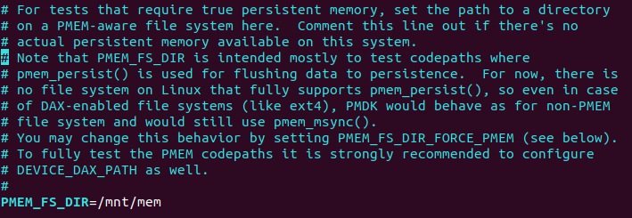

随后设置DEVICE_DAX_PATH为/dev/pmem0

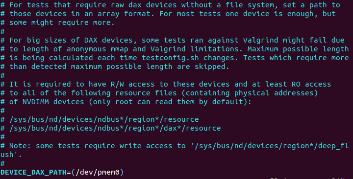

其他的可以暂时先不设置，设置这两项的原因主要是看看/dev/pmem0是否能正确被检测为persistent memory

随后进入/pmdk/src/ 文件夹执行make check指令，不出意外的话不会出现错误。

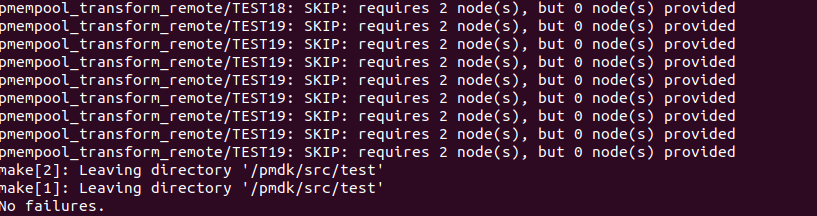

接下来检验/mnt/mem是否被判定为pmem区域。

编辑/pmdk/src/examples/libpmem文件夹中的manpage.c文件，将变量PATH修改为/mnt/mem/test，并在/mnt/mem 文件夹中创建一个文件test。

注意到main函数中已有一函数pmem_map_file(),该函数会调用另一个函数pmem_is_pmem()来判断参数PATH是否处于pmem区域，如果是则设置pmem_map_file()中的一个参数is_pmem为1，否则为0.

根据这个写出以下代码来判断path是否为真正的pmem区域：

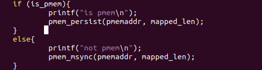

执行make 进行编译，随后./manpage 执行：

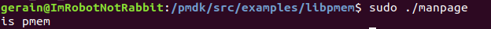

这说明我们的/mnt/mem文件夹也是被判定为pmem区域的。


## 论文阅读

### 总结一下本文的主要贡献和观点(500字以内)(不能翻译摘要)。
（回答本文工作的动机背景是什么，做了什么，有什么技术原理，解决了什么问题，其意义是什么）

SCM(Storage Class Memory)这一类新型的储存介质的出现使得人们开始思考新型的数据库的数据结构。由于SCM兼具内存按字节访问以及外存掉电后数据不丢失的特点，人们开始考虑将内外存结合起来，即SCM既当内存也是外存，并基于这类结构开发了几类新型的数据结构。
但是由于SCM的延迟显著高于DRAM，这类数据结构的读写延迟比单纯以DRAM存储数据的B+树要高很多。为了使SCM为基础的数据库的性能接近于直接存储在DRAM的数据库的性能，作者设计了FPTree，使用DRAM与SCM结合的存储模型，其实际是B+树的变种。B+树的内部节点存放于DRAM中，叶节点存放于SCM中。由于非叶节点存放于DRAM中，而且结构于B+树一样，key值有序地存放在节点内部，所以SCM-DRAM结合的模型性能上只有访问叶子节点时性能比DRAM模型差。而叶子节点由bitmap, fingerprint, 持久化指针，键值对和同步锁组成，且键值对无序的放在叶子节点上，这种结构提供了数据的持久性，接近于DRAM的性能，健壮的性能表现，快速的数据恢复，高的可扩展性以及可变长度key值的支持。
作者提供了可靠的数据模型来尽可能地发挥SCM的性能，为SCM普及应用提供了理论基础。

### SCM硬件有什么特性？与普通磁盘有什么区别？普通数据库以页的粒度读写磁盘的方式适合操作SCM吗？

SCM硬件具有按字节寻址，读写延迟低（和普通磁盘相比），读写延迟不对称（读显著高于写），非易失性（断电不丢失），储存密度比DRAM高，节能高效等特点。

SCM和普通磁盘的区别主要在于：

- 寻址方式不同，SCM按字节寻址，普通磁盘按块寻址
- 读写延迟不同，普通磁盘寻址需要耗费大量的时间在寻道上，同时读写效率也很低，所以应尽可能地读写连续的地址，避免无用的寻道带来的时间花销，SCM没有寻道环节，读写每一个地址需要的时间比较稳定而且显著低于普通磁盘，所以能很好地支持随机读写。

普通数据库为了适应传统磁盘按块读写，寻址时间长的特点，设计了以页为粒度的磁盘读写方式，然而在SCM中，由于SCM按字节寻址，且寻址时间很稳定，若只需要从页内读或写部分(K, V)对，此时需要读取或写入整个页来获取或写入其中极少数数据，对于SCM来说极为浪费，为了发挥SCM的按字节随机寻址的特点，应该直接读写对应的地址才对。所以普通数据库以页的粒度读写磁盘的方式并不适合操作SCM。

### 操作SCM为什么要调用CLFLUSH等指令？
(写入后不调用，发生系统崩溃有什么后果)

由于操作系统写入SCM时并不会将数据直接写入SCM，而是将数据先写入cache，cache需要发生调度时再将数据真正写入SCM。但由于cache是易失性的储存介质，掉电后或系统崩溃后数据会丢失，若在数据写入cache而没有真正写入SCM时发生系统崩溃，则应写入SCM的数据会由于cache数据的丢失而丢失。
CLFLUSH的作用是强制缓存刷新，使包括传入的字节地址的任意一级缓存失效，即强制将缓存的数据传入SCM。缓存的刷新保证了需要写入SCM的数据已经真正写入SCM，不会发生系统崩溃后数据丢失的后果。

### FPTree的指纹技术有什么重要作用？

SCM的硬件特点决定了其写入延迟显著地高于读取延迟，B树叶子节点数据若有序排列，此时插入一个数据需要类似于插入排序的一个插入步骤，把叶子节点内部每一个大于新插入的key值的数据依次向后挪动一位，删除叶子节点的数据需要把每一个小于删除的key值的数据依次向前挪动一位（若叶子节点不需要分裂或合并），这样子会在添加和删除键值对时带来大量的写入操作，极大地影响性能。
所以FPTree叶子节点内部的数据是无序排列的，并且使用一个bitmap记录每一个槽是否存放数据，这样添加新数据（不与其他数据重复）时只需在bitmap中找到没有找到没有存放数据的槽并进行一次写入，删除数据时只需要把bitmap对应的位置0即可（若没有分裂或合并操作）。这样子将写入的次数限制为1次，由于SCM的写入延迟明显高于读取延迟，将写入次数降低会大大提高性能表现。
但叶子节点内部数据的无序排放使得寻找数据时需要线性探测存放有数据的槽，使得寻找数据的时间复杂度是线性的，性能明显低于有序排放时二分查找的对数级别的复杂度。

为了加速查询叶子节点数据的速度，使用指纹技术。
FPTree的叶子节点的结构为位图+pnext指针+连续分布各个槽的指纹以及储存的键值对和8位的同步锁组成。
FPTree使用位图记录节点内部的每个槽的使用情况，使用8位的哈希值作为每个槽数据键的指纹，连续分布在叶子节点内部中。键值对前的数据大小是cache line的大小。在查询需要的键值对时，首先读取叶子节点的键值对前的数据（即bitmap+pnext+fingerprints）进入缓存，通过bitmap排除没有存放数据的槽，然后线性扫描记录的指纹，若查询的键的哈希值与某个槽的指纹相同则找到叶子节点对应的槽内存放的数据的键是否为查找的键，若是，则返回对应的值，若不是，继续扫描，直至扫描完成。扫描完成后还没有返回对应的值，则查找的键不存在。


此时计算一次成功的查找（即找到需要查询的数据）需要对叶子节点内部数据的探测次数，期望值为
$$E[T] = \frac{1}{2}\left(1+\frac{m}{n\left(1-\left(\frac{n-1}{n}\right)^m\right)}\right)$$
其中m为叶子节点键值对的个数，n为哈希值（即指纹）的个数。
取n=256(一个字节，即8bit可以有256个指纹)

对于m=32,探测的期望值约为1.031，即可以将探测次数限制在1次,探测次数在$m\approx700$时期望值才升到两次。而NVTRee拥有对数级别的复杂度，在$m\approx4096$时NVTree的性能才超过FPTree。


### 为了保证指纹技术的数学证明成立，哈希函数应如何选取？
（哈希函数生成的哈希值具有什么特征，能简单对键值取模生成吗？）

哈希函数在该叶子节点内部的数据的键生成的哈希值应为均匀分布。简单地对键值取模很有可能不能生成均匀分布的哈希值。如取m=32,n取256，即叶子节点能够存放的数据的期望值为32，哈希值的取值为256种，即0到255，若某一个叶子节点的左右边界为1和40，若简单地对256取模则生成的哈希值将分布于1到40的范围，分布不均匀。

可以考虑将左右边界均匀映射到0到n-1的范围，即
$$hash(key)=\left[\frac{n(key-l)}{r-l}\right]$$
其中key为叶子节点内部的键值，l为叶子节点的左边界，r为叶子节点的右边界。
但若使用这种哈希，则叶子节点左右边界发生变化时需要重新计算哈希值。

### 持久化指针的作用是什么？与课上学到的什么类似？

持久化指针由8 byte的file_id 和 8 byte的文件内部偏移组成，指向该叶子节点的下一个节点，作用有：

1. 提供范围搜索的支持，叶子节点有指向下一个叶子节点的指针，这允许我们进行范围搜索。
2. 提供数据恢复的功能。由于SCM是非易失性的存储介质，发生故障后数据能够保存，可以通过SCM的数据进行数据恢复。这要求SCM的pnext指针也是持久性的。由于文件指针可以指向唯一的合法的文件，加上文件内部的偏移即可唯一地指向SCM中的一个地址，这些属性在故障发生时仍然有效，所以此时pnext指针也仍然有效。FPTree可以进行持久性指针与非持久性指针（即内存中的指针）的双向转换。

这与操作系统的动态地址重定位思想比较相似，对于一个纯段式管理的程序，其地址的定位时是根据段号以及段内偏移构成，这样一个程序在运行时即使发生了内存位置的变化，程序的寻址仍是正确的。
